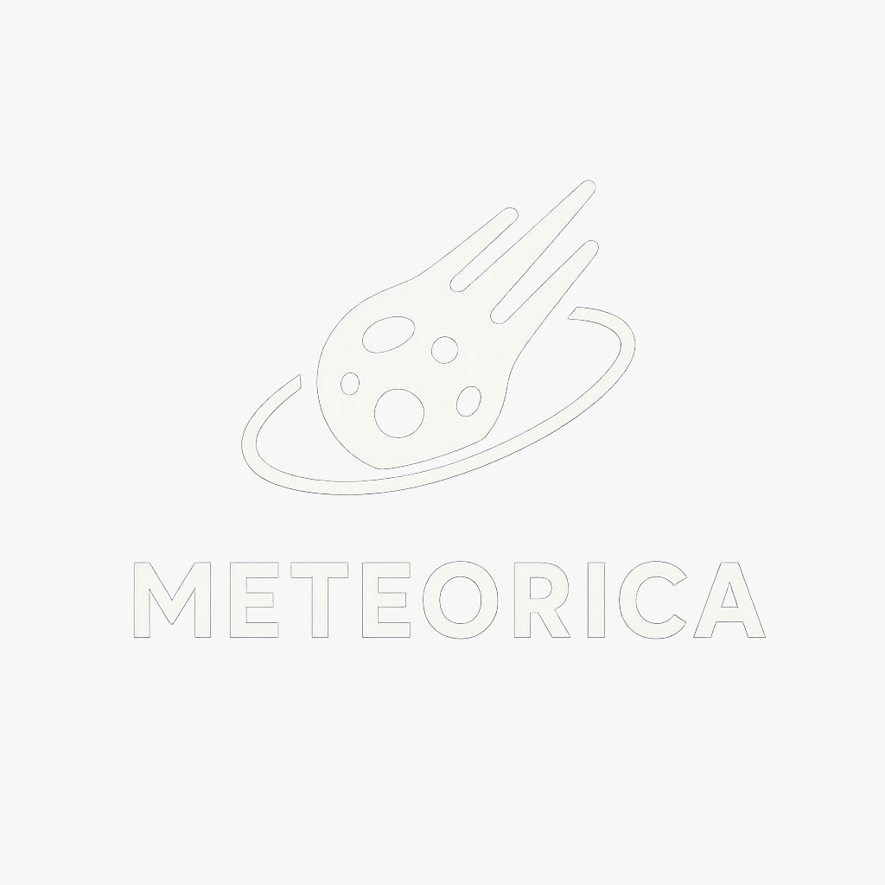

<div align="center">
  
  
  # 🌍 Meteorica
  
  ### NASA Space Apps Challenge 2025
  
  **An Interactive Meteorite Impact Simulator & Educational Platform**
  
  [](https://www.spaceappschallenge.org/)
  [](https://laravel.com)
  [](https://reactjs.org/)
  [](https://www.typescriptlang.org/)
  [](LICENSE)
  
  [Live Demo](#) • [Features](#features) • [Installation](#installation) • [Documentation](#documentation)
  
</div>

---

## 📋 Table of Contents

- [Overview](#overview)
- [Features](#features)
- [Technology Stack](#technology-stack)
- [Screenshots](#screenshots)
- [Installation](#installation)
- [Usage](#usage)
- [API Documentation](#api-documentation)
- [Project Structure](#project-structure)
- [Contributing](#contributing)
- [Team](#team)
- [License](#license)

---

## 🌟 Overview

**Meteorica** is a comprehensive web-based platform that combines real NASA data with cutting-edge web technologies to create an immersive educational experience about meteorite impacts. Built for the NASA Space Apps Challenge 2025, this project aims to make space science accessible, interactive, and engaging for students, educators, and space enthusiasts worldwide.

### 🎯 Mission

Our mission is to educate and inspire the next generation of space scientists by providing:
- **Real-time impact simulations** based on authentic NASA Near-Earth Object (NEO) data
- **Interactive learning modules** teaching the physics behind meteorite impacts
- **Comprehensive database** of 160M+ documented meteorites from NASA
- **AI-powered assistance** to answer questions and provide insights
- **Gamified learning** experience with practical tasks and achievements

---

## ✨ Features

### 🚀 Meteorite Impact Simulator
- **Real-time 3D visualization** of meteorite impacts using Three.js
- **Customizable parameters**: radius, velocity, entry angle, and material composition
- **Accurate physics calculations**:
  - Kinetic energy (KE = ½mv²)
  - Crater diameter estimation
  - Atmospheric fragmentation analysis
  - Impact energy in TNT equivalent (megatons)
- **Interactive map integration** to visualize impact zones worldwide
- **Downloadable results** with shareable impact cards for social media

### 🎓 NASA Academy
- **Structured learning path** with 3 comprehensive lessons:
  1. **Understanding Meteoroid Radius** (12 min, Beginner)
     - Cubic relationship between radius and mass
     - Real-world examples: Chelyabinsk, Tunguska
  2. **Impact Velocity and Kinetic Energy** (15 min, Beginner)
     - Squared velocity relationship
     - TNT equivalence calculations
  3. **Atmospheric Entry and Fragmentation** (20 min, Intermediate)
     - Ram pressure physics
     - Material strength analysis
- **Practical tasks** integrated with the simulator
- **Progress tracking** with completion badges
- **Markdown-based content** for easy updates

### 🗄️ Meteorite Database
- **160M+ NASA meteorites** with verified scientific data
- **User-created simulations** gallery
- **Advanced filtering** by:
  - Classification (chondrite, iron, stony-iron, etc.)
  - Discovery year
  - Mass range
  - Geographic location
- **Direct import to simulator** for quick experimentation
- **Detailed metadata** including coordinates, mass, and composition

### 🤖 NASAbot AI Assistant
- **Powered by Google Gemini AI** for intelligent responses
- **Context-aware explanations** of simulation results
- **Educational Q&A** about:
  - Atmospheric physics (f_atm parameter)
  - Impact energy calculations
  - Crater formation mechanics
  - Fragmentation effects
- **Multilingual support** (English/Spanish)
- **Floating chat interface** accessible from any page

### 📊 Data Visualization
- **Interactive 3D Earth model** with realistic textures
- **Impact crater visualization** with shock wave animations
- **Real-time parameter updates** reflected in the 3D scene
- **Comparison tools** for different impact scenarios
- **Statistical insights** from simulation results

### 🌐 Social Sharing
- **Professional impact cards** with auto-generated graphics
- **One-click sharing** to:
  - Instagram (with caption copy)
  - Facebook
  - Twitter
  - WhatsApp
- **Engagement features** for educational outreach

---

## 🛠️ Technology Stack

### Backend
- **Framework**: Laravel 12.x (PHP 8.2+)
- **Database**: PostgreSQL (SQLite for development)
- **Authentication**: Laravel Fortify
- **API Integration**: NASA NEO API, Supabase
- **AI**: Google Gemini PHP Client

### Frontend
- **Framework**: React 19.0
- **Language**: TypeScript 5.7
- **Routing**: Inertia.js 2.x (SSR-ready)
- **Styling**: TailwindCSS 4.0
- **Animations**: Framer Motion
- **3D Graphics**: React Three Fiber + Three.js
- **Forms**: React Hook Form + Zod validation
- **UI Components**: Radix UI primitives
- **Maps**: React Leaflet
- **Markdown**: React Markdown

### Development Tools
- **Build Tool**: Vite 7.x
- **Testing**: Pest (PHP), React Testing Library
- **Code Quality**: ESLint, Prettier, Laravel Pint
- **Version Control**: Git

---

## 📸 Screenshots

### 🏠 Landing Page
Beautiful hero section with animated background and clear call-to-action buttons.

### 🎮 Interactive Simulator
Real-time 3D visualization with customizable parameters and instant feedback.

### 📚 NASA Academy
Structured lessons with learning objectives, key concepts, and practical tasks.

### 🗺️ Impact Map
Global visualization of impact zones with crater radius overlay.

### 🤖 AI Assistant
Intelligent chatbot providing context-aware explanations and educational support.

---

## 🚀 Installation

### Prerequisites
- PHP 8.2 or higher
- Composer 2.x
- Node.js 20.x or higher
- PostgreSQL (or SQLite for development)
- Git

### Step 1: Clone the Repository
```bash
git clone https://github.com/Roberto0611/nasa.git
cd nasa
```

### Step 2: Install PHP Dependencies
```bash
composer install
```

### Step 3: Install Node Dependencies
```bash
npm install
```

### Step 4: Environment Configuration
```bash
# Copy environment file
cp .env.example .env

# Generate application key
php artisan key:generate
```

### Step 5: Configure Environment Variables
Edit `.env` and set:
```env
# Database
DB_CONNECTION=pgsql
DB_HOST=127.0.0.1
DB_PORT=5432
DB_DATABASE=meteorica
DB_USERNAME=your_username
DB_PASSWORD=your_password

# Google Gemini AI
GEMINI_API_KEY=your_gemini_api_key

# NASA API (optional)
NASA_API_KEY=your_nasa_api_key

# Supabase (for meteorite data)
SUPABASE_URL=your_supabase_url
SUPABASE_KEY=your_supabase_key
```

### Step 6: Database Setup
```bash
# Run migrations
php artisan migrate

# Seed the database (includes lesson content)
php artisan db:seed
```

### Step 7: Build Frontend Assets
```bash
# Development build with hot reload
npm run dev

# Production build
npm run build
```

### Step 8: Start Development Server
```bash
# Start Laravel server
php artisan serve

# Or use the integrated dev command (runs server + queue + vite)
composer dev
```

Visit `http://localhost:8000` in your browser! 🎉

---

## 📖 Usage

### Running Simulations

1. **Navigate to Simulator**: Click "Try Simulation" from the landing page
2. **Select Meteoroid**: Choose from NASA database or create custom
3. **Set Parameters**:
   - Radius: 1-100+ meters
   - Velocity: 11-72 km/s (cosmic speeds)
   - Entry Angle: 0-90 degrees
   - Material: Rock, Iron, or Nickel
4. **Choose Impact Location**: Click on the interactive map
5. **Simulate**: Click "Simulate Impact" to see results
6. **Analyze Results**: View energy, crater size, and fragmentation data
7. **Share**: Download impact card and share on social media

### Learning Path

1. **Explore Academy**: Visit `/academy` to see all lessons
2. **Start Lesson**: Click "Start Lesson" on any topic
3. **Read Content**: Learn about physics concepts with real examples
4. **Complete Task**: Try the practical exercise in the simulator
5. **Mark Complete**: Track your progress

### Using NASAbot

1. **Access Chat**: Click the chat icon (floating button)
2. **Ask Questions**: Type your question about space science
3. **Get Explanations**: Receive AI-powered answers with context
4. **Quick Questions**: Use suggested prompts for common topics

---

## 🔌 API Documentation

### Meteorite Endpoints

#### Get NASA Meteorite by ID
```http
GET /getMeteoriteById/{id}
```

**Response:**
```json
{
  "name": "Chelyabinsk",
  "atmospheric_impact": {
    "crater_diameter_m": 18.5,
    "broke": true
  },
  "calculations": {
    "kinetic_energy_initial_megatons_tnt": 0.59
  }
}
```

#### Get User Meteorite by ID
```http
GET /getUserMeteoriteById/{id}
```

#### Store User Meteorite
```http
POST /meteorites/store
```

**Request Body:**
```json
{
  "namemeteroid": "Custom Impact",
  "radius": 10,
  "velocity": 15000,
  "angle": 45,
  "material": "rock",
  "lat": 40.7128,
  "lng": -74.0060
}
```

### Lesson Endpoints

#### Get All Lessons
```http
GET /academy
```

#### Get Lesson by Slug
```http
GET /academy/{slug}
```

#### API JSON Endpoint
```http
GET /api/lessons
```

### Chat Endpoint

#### Send Message to NASAbot
```http
POST /chat
```

**Request Body:**
```json
{
  "message": "What is atmospheric fragmentation?"
}
```

---

## 📁 Project Structure

```
meteorica/
├── app/
│   ├── Http/
│   │   ├── Controllers/
│   │   │   ├── LessonController.php      # Academy lessons
│   │   │   └── ChatController.php        # NASAbot AI
│   │   └── Requests/
│   ├── Models/
│   │   ├── User.php
│   │   └── Lesson.php                    # Lesson model
│   └── Providers/
│
├── database/
│   ├── migrations/
│   │   ├── 2025_10_05_061347_create_lessons_table.php
│   │   └── ...
│   └── seeders/
│       └── LessonSeeder.php              # Educational content
│
├── resources/
│   ├── js/
│   │   ├── components/
│   │   │   ├── formtesting.tsx           # Simulation form
│   │   │   ├── FloatingChat.tsx          # AI chat interface
│   │   │   └── ui/                       # Radix UI components
│   │   ├── context/
│   │   │   └── MeteroidContext.tsx       # Global state
│   │   ├── pages/
│   │   │   └── public/
│   │   │       ├── landingPage.tsx       # Home page
│   │   │       ├── SimulationPage.tsx    # Main simulator
│   │   │       ├── Academy.tsx           # Lessons list
│   │   │       ├── LessonDetail.tsx      # Individual lesson
│   │   │       ├── MeteoritesPage.tsx    # Database gallery
│   │   │       ├── NasaBot.tsx           # AI chat page
│   │   │       └── map.page.tsx          # Impact map
│   │   └── assets/
│   │       └── Planets/
│   │           └── personalizableplanet.tsx  # 3D Earth
│   │
│   ├── css/
│   │   └── app.css                       # TailwindCSS
│   └── views/
│       └── app.blade.php                 # Main layout
│
├── routes/
│   ├── web.php                           # Application routes
│   └── auth.php                          # Authentication routes
│
├── public/
│   └── build/                            # Compiled assets
│
├── tests/                                # Pest tests
│
├── package.json                          # Node dependencies
├── composer.json                         # PHP dependencies
├── vite.config.ts                        # Vite configuration
├── tsconfig.json                         # TypeScript config
└── README.md                             # This file
```

---

## 🧪 Testing

### Run PHP Tests
```bash
composer test
# or
php artisan test
```

### Run Type Checking
```bash
npm run types
```

### Lint & Format
```bash
# JavaScript/TypeScript
npm run lint
npm run format

# PHP
./vendor/bin/pint
```

---

## 🎨 Design System

### Colors
- **Primary**: Blue (#3b82f6) - Links, CTAs, highlights
- **Secondary**: Purple (#a855f7) - Gradients, accents
- **Success**: Green (#22c55e) - Completion, success states
- **Warning**: Yellow (#eab308) - Intermediate difficulty
- **Danger**: Red (#ef4444) - Critical warnings, advanced difficulty
- **Background**: Black/Gray 900 - Main background
- **Text**: White/Gray 300 - Primary text

### Typography
- **Font**: System UI stack (Arial, Helvetica, sans-serif)
- **Headings**: Bold, large scale (text-4xl to text-7xl)
- **Body**: Regular weight, gray-300 for readability

### Components
All UI components follow Radix UI patterns with custom Tailwind styling.

---

## 🤝 Contributing

We welcome contributions from the community! Here's how you can help:

### 1. Fork the Repository
```bash
git clone https://github.com/your-username/nasa.git
```

### 2. Create a Feature Branch
```bash
git checkout -b feature/amazing-feature
```

### 3. Make Your Changes
- Follow existing code style
- Add tests for new features
- Update documentation as needed

### 4. Commit Your Changes
```bash
git commit -m "Add amazing feature"
```

### 5. Push to Your Fork
```bash
git push origin feature/amazing-feature
```

### 6. Open a Pull Request
Submit a PR with a clear description of your changes.

### Code Standards
- **PHP**: Follow PSR-12 coding standards
- **JavaScript/TypeScript**: Use ESLint + Prettier configuration
- **Commits**: Use conventional commit messages
- **Tests**: Write tests for new features

---

## 👥 Team

**Meteorica** was developed by a passionate team for the NASA Space Apps Challenge 2025.

### Contributors
- **Roberto** - Full-stack Developer & Project Lead
- [Add team members]

### Acknowledgments
- NASA for providing open NEO data
- Space Apps Challenge organizers
- Open-source community for amazing tools

---

## 📄 License

This project is licensed under the MIT License - see the [LICENSE](LICENSE) file for details.

---

## 🌐 Resources

### NASA Data Sources
- [NASA NEO API](https://api.nasa.gov/)
- [Meteorite Landings Database](https://data.nasa.gov/Space-Science/Meteorite-Landings/gh4g-9sfh)

### Educational Resources
- [NASA Asteroid Watch](https://www.nasa.gov/asteroidwatch)
- [Impact Earth Calculator](https://impact.ese.ic.ac.uk/ImpactEarth/)
- [Planetary Defense Coordination Office](https://www.nasa.gov/planetarydefense)

### Technologies Used
- [Laravel Documentation](https://laravel.com/docs)
- [React Documentation](https://react.dev/)
- [Three.js Documentation](https://threejs.org/docs/)
- [Inertia.js Documentation](https://inertiajs.com/)

---

## 📞 Contact

Have questions or suggestions? Reach out!

- **Project Repository**: [GitHub](https://github.com/Roberto0611/nasa)
- **Email**: [Contact us](mailto:contact@meteorica.app)
- **Twitter**: [@MoritekaSim](#)

---

<div align="center">
  
  ### 🌟 Made with ❤️ for NASA Space Apps Challenge 2025
  
  **Educating the world about space, one impact at a time** 🚀
  
  ⭐ Star this repo if you found it helpful!
  
</div>
